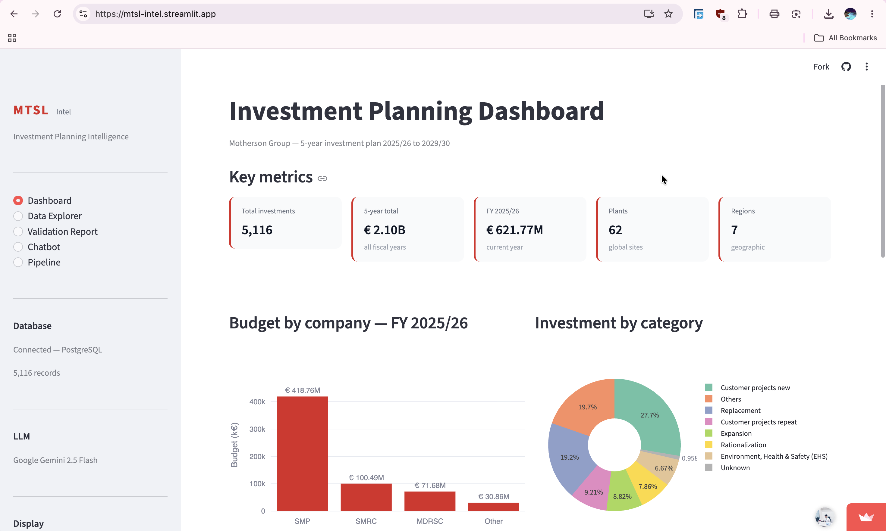
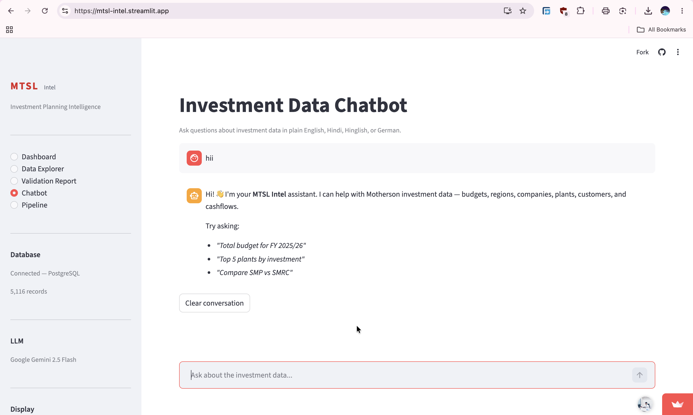

# MTSL Intel — Motherson Investment Intelligence

A Streamlit app and chatbot for exploring Motherson's five-year capital investment plan (FY 2025/26 to FY 2029/30). Ask questions in plain language and get tables, charts and the SQL behind each answer.

**Live demo:** https://mtsl-intel.streamlit.app/

**Dashboard**



**Chatbot**



## What it does

- **Data pipeline:** ingests an Excel file, cleans it, validates it and loads it into PostgreSQL.
- **Dashboard:** budget by company, region and fiscal year, investment categories, funding sources and top plants.
- **Data Explorer:** filter investments by company, region, category and plant, and download as CSV.
- **Validation Report:** pass rate for every validation rule, plus the rows that were quarantined.
- **Chatbot:** answers questions in English, Hindi, Hinglish and German. Results can be downloaded as CSV, Excel or PDF, and the generated SQL is always shown.

## Data at a glance

| Item | Value |
|---|---|
| Records loaded | 5,116 (5,170 processed, 54 quarantined) |
| Plants / regions | 62 / 7 |
| 5-year plan total | about €2.10B (after validation) |
| Cleaning rules | 8 |
| Validation rules | 11 (99% of records passed; 54 quarantined) |

## How it works

```
Excel file
   |
   v
1. Ingestion   -> reads the raw sheet, standardises column names
2. Cleaning    -> 8 rules (nulls, placeholders, value fixes, normalisation, duplicates), every change logged
3. Validation  -> 11 rules (HARD / SOFT); failing rows go to quarantine
4. Database    -> PostgreSQL tables: investments, investment_budget,
                  investment_monthly_cashflow, investment_quarantine
   |
   v
Streamlit app (Dashboard, Data Explorer, Validation Report, Chatbot, Pipeline)
```

**Chatbot flow:** a rule-based intent parser first detects the company, region, plant, category and fiscal year in the question and builds the SQL. If it cannot handle the question, Google Gemini 2.5 Flash generates the SQL instead. The query is then run on PostgreSQL and the result is shown as a table and chart.

## Tech stack

Python, Pandas, PostgreSQL (SQLAlchemy, psycopg2), Streamlit, Plotly, Google Gemini 2.5 Flash, ReportLab and OpenPyXL for exports.

## Run it locally

1. Install dependencies:
   ```bash
   pip install -r requirements.txt
   ```
2. Create a `.env` file in the project root:
   ```
   DB_HOST=localhost
   DB_PORT=5432
   DB_NAME=motherson_intel
   DB_USER=postgres
   DB_PASSWORD=your_password
   GEMINI_API_KEY=your_gemini_key
   ```
3. Place the source Excel file in `data/raw/`, then load the database:
   ```bash
   python src/pipeline.py --reload
   ```
4. Start the app:
   ```bash
   streamlit run app.py
   ```

## Project structure

```
app.py              Streamlit app (5 pages)
src/ingestion.py    Layer 1: read Excel
src/cleaning.py     Layer 2: cleaning rules + audit log
src/validation.py   Layer 3: validation rules + quarantine
src/database.py     Layer 4: PostgreSQL schema and load
src/pipeline.py     Runs layers 1-4 in order
src/chatbot.py      Intent parser, SQL builder, Gemini fallback
data/logs/          Cleaning log, validation report, quarantine
```

## Limitations

- The chatbot's rule-based parser covers common question types; unusual questions rely on Gemini and may need rephrasing.
- Built as an internship prototype, not a hardened production system.
- The source dataset is confidential and is not part of this repository.
